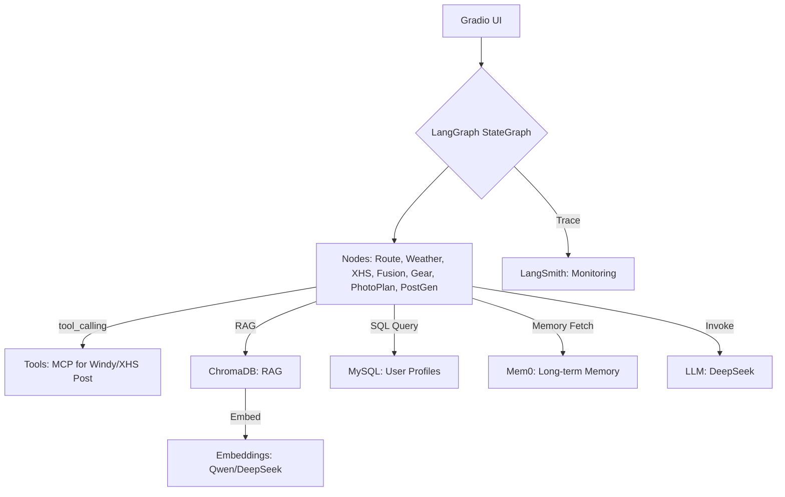

# HikeButler - 徒步私人管家 AI Agent

基于 LangGraph 的智能徒步助手，支持徒步准备和复盘全链路，以用户画像驱动个性化推荐。

## 项目概述

HikeButler 是一个个性化的徒步 AI Agent，旨在覆盖徒步活动的准备阶段（路线规划、天气查询、装备建议、拍摄计划）和复盘阶段（轨迹分析、社交媒体帖子生成）。

### 核心特性

- 🗺️ **智能路线规划**：根据用户偏好和历史数据生成个性化路线建议
- 🌤️ **天气查询**：通过 Windy API 获取实时天气预报
- 🎒 **装备建议**：基于路线、天气和用户画像生成装备清单
- 📸 **拍摄计划**：根据路线特点生成最佳拍摄计划
- 📝 **复盘帖子生成**：根据 GPX 轨迹、照片和感想生成社交媒体帖子
- 🔄 **长期记忆**：使用 Mem0 管理用户长期记忆，提供个性化推荐

## 技术栈

- **核心框架**：LangGraph（Agent 工作流）
- **监控追踪**：LangSmith（调用链路追踪、性能分析）
- **向量库**：ChromaDB（RAG 检索）
- **关系数据库**：MySQL（用户画像和历史数据）
- **记忆框架**：Mem0（长期记忆管理）
- **LLM**：DeepSeek（默认，支持配置化切换）
- **Embedding**：Qwen-Embed（默认，支持配置化切换）
- **UI 框架**：Gradio
- **依赖管理**：Poetry

## 项目结构

```
hiking-agent/
├── hikebutler/              # 主代码目录
│   ├── __init__.py
│   ├── main.py              # 程序入口
│   ├── state.py             # LangGraph State 定义
│   ├── config/              # 配置管理
│   │   ├── __init__.py
│   │   └── loader.py        # 配置加载器
│   ├── nodes/               # LangGraph 节点
│   │   ├── __init__.py
│   │   ├── route_node.py    # 路线规划节点
│   │   ├── weather_node.py  # 天气查询节点
│   │   ├── gear_node.py     # 装备建议节点
│   │   ├── photo_plan_node.py  # 拍摄计划节点
│   │   ├── fusion_node.py   # 信息融合节点
│   │   ├── post_gen_node.py # 帖子生成节点
│   │   └── xhs_node.py      # 小红书发布节点
│   ├── tools/               # MCP 工具
│   │   ├── __init__.py
│   │   └── mcp_tools.py     # MCP 工具定义
│   ├── models/              # 模型管理
│   │   ├── __init__.py
│   │   ├── llm_factory.py   # LLM 工厂
│   │   └── embedding_factory.py  # Embedding 工厂
│   ├── database/            # 数据库客户端
│   │   ├── __init__.py
│   │   ├── mysql_client.py  # MySQL 客户端
│   │   └── chromadb_client.py  # ChromaDB 客户端
│   ├── memory/              # 记忆管理
│   │   ├── __init__.py
│   │   └── mem0_client.py   # Mem0 客户端
│   ├── graph/               # LangGraph 工作流
│   │   ├── __init__.py
│   │   └── workflow.py      # 工作流定义
│   └── ui/                  # Gradio UI
│       ├── __init__.py
│       └── gradio_app.py    # UI 应用
├── config/                  # 配置文件
│   ├── config.yaml          # 主配置文件
│   └── models.yaml          # 模型配置文件
├── tests/                   # 测试代码
│   ├── __init__.py
│   ├── test_config_loader.py
│   ├── test_state.py
│   └── test_nodes.py
├── pyproject.toml           # Poetry 依赖配置
├── .gitignore
└── README.md
```

## 安装指南

### 前置要求

- Python 3.12+
- MySQL 8.0+
- Poetry（推荐）或 pip

### 安装步骤

1. **克隆项目**

```bash
git clone <repository-url>
cd hiking-agent
```

2. **安装依赖**

使用 Poetry（推荐）：
```bash
poetry install
poetry shell
```

或使用 pip：
```bash
pip install -r requirements.txt
```

3. **配置环境变量**

复制 `.env.example` 为 `.env` 并填写相关配置：

```bash
cp .env.example .env
```

编辑 `.env` 文件，填入：
- LLM API Keys（DeepSeek、Qwen 等）
- LangSmith API Key
- MySQL 连接信息
- Mem0 API Key（可选）
- 其他配置项

4. **初始化数据库**

```bash
python -c "from hikebutler.database.mysql_client import MySQLClient; client = MySQLClient(); client.connect(); client.init_tables(); client.close()"
```

5. **启动应用**

```bash
python -m hikebutler.main
```

或直接运行：
```bash
python hikebutler/main.py
```

应用将在 `http://127.0.0.1:7860` 启动。

## 使用指南

### 徒步准备

1. 打开浏览器访问 `http://127.0.0.1:7860`
2. 切换到"徒步准备"标签页
3. 输入：
   - 徒步地点（如：北京香山）
   - 期望时长（半天/一天/两天/三天以上）
   - 难度偏好（简单/中等/困难/极限）
   - 用户 ID（可选）
4. 点击"生成徒步计划"
5. 查看生成的装备清单和徒步计划

### 徒步复盘

1. 切换到"徒步复盘"标签页
2. 上传：
   - GPX 轨迹文件
   - 照片（可多选）
   - 个人感想
3. 点击"生成复盘帖子"
4. 查看生成的帖子预览
5. 点击"发布到小红书"进行发布（需要配置 MCP 工具）

## 配置说明

### 模型切换

项目支持通过配置文件切换模型，无需修改代码：

1. 编辑 `config/models.yaml`
2. 修改 `llm.provider` 和 `embedding.provider`
3. 配置对应的 API Key
4. 重启应用

示例：
```yaml
llm:
  provider: qwen  # 从 deepseek 切换到 qwen
  model_name: qwen-turbo
  api_key: ${QWEN_API_KEY}
```

### RAG 配置

在 `config/config.yaml` 中配置 RAG 参数：

```yaml
rag:
  chunk_size: 500
  chunk_overlap: 50
  top_k: 5
  similarity_threshold: 0.7
```

## 开发指南

### 代码规范

- 遵循 PEP 8 规范
- 使用 Black 进行代码格式化：`black hikebutler/`
- 使用 Flake8 进行代码检查：`flake8 hikebutler/`
- 函数和类名使用小驼峰命名法
- 变量使用小写下划线命名法
- 每个模块必须包含 docstring

### 运行测试

```bash
# 运行所有测试
pytest

# 运行测试并生成覆盖率报告
pytest --cov=hikebutler --cov-report=html

# 运行特定测试文件
pytest tests/test_nodes.py
```

### 添加新节点

1. 在 `hikebutler/nodes/` 目录下创建新节点文件
2. 实现节点函数，接受 `HikeButlerState` 并返回更新后的状态
3. 在 `hikebutler/graph/workflow.py` 中注册节点
4. 添加相应的测试

### 添加新工具

1. 在 `hikebutler/tools/mcp_tools.py` 中定义新工具函数
2. 在 `hikebutler/graph/workflow.py` 中将工具添加到工具列表
3. 在节点中通过 `tool_calling` 机制调用

## 系统架构



## 监控与日志

- **LangSmith**：所有 LangGraph 执行过程都会追踪到 LangSmith
- **日志**：使用 Python logging 模块，日志级别可在配置中调整
- **告警**：当错误率超过 5% 时触发通知（需配置）

## 安全规范

- API Key 通过环境变量管理，严禁硬编码
- 用户数据在 MySQL 中使用 AES 加密
- 敏感信息不会在日志中以明文形式记录

## 版本控制

- **分支策略**：主分支 `main`，开发分支 `feature/{name}`，发布分支 `release/{version}`
- **Commit 格式**：`[type]: {description}`（如：`[feat]: add route node`）
- **代码审查**：所有 Pull Request 必须通过审查

## 未来扩展

- **V1**：云端部署（多用户支持）、优化用户画像系统
- **V2**：多模态能力（语音输入）、集成更多 MCP 工具（预订住宿、交通查询）

## 许可证

[待添加]

## 贡献指南

欢迎提交 Issue 和 Pull Request！

## 联系方式

[待添加]
